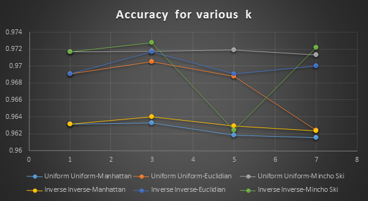

k-Nearest Neighbour Classification of MNIST Data
================================================
K Nearest Algorithm is another discriminative model, that classifies data based on their similarity. There is again no model that is built apriori, but every new data point is discriminated online.

The discrimination is done on the basis of a similarity measure, that is used to find k data points in L, that resemble the closest with x. These k data points are said to belong to the neighbourhood of x, and then we make an assumption that x, will most likely be like the majority of neighbourhood and give the label of the label carried by majority points in the neighbourhood to x.

The similarity measure, is referred to as distance, and is computed using various methods.
Usually the distance is measured in Euclidian space, but other measure like Manhattan and Chebushev, Minchowski, etc. are also used. We also consider the label of the data point in the k neighbourhood to be less important as its distance grows from x.

Results
====
| Number of Neighbours | Weights | Distance       | Accuracy |
|----------------------|---------|----------------|----------|
| 1                    | Uniform | Manhattan      | 0.9631   |
| 3                    | Uniform | Manhattan      | 0.9633   |
| 5                    | Uniform | Manhattan      | 0.9618   |
| 7                    | Uniform | Manhattan      | 0.9615   |
| 1                    | Uniform | Euclidian      | 0.9691   |
| 3                    | Uniform | Euclidian      | 0.9705   |
| 5                    | Uniform | Euclidian      | 0.9688   |
| 7                    | Uniform | Euclidian      | 0.9624   |
| 1                    | Uniform | Mincho ski (3) | 0.9717   |
| 3                    | Uniform | Mincho ski (3) | 0.9718   |
| 5                    | Uniform | Mincho ski (3) | 0.9719   |
| 7                    | Uniform | Mincho ski (3) | 0.9713   |
| 1                    | Inverse | Manhattan      | 0.9631   |
| 3                    | Inverse | Manhattan      | 0.9640   |
| 5                    | Inverse | Manhattan      | 0.9629   |
| 7                    | Inverse | Manhattan      | 0.9623   |
| 1                    | Inverse | Euclidian      | 0.9691   |
| 3                    | Inverse | Euclidian      | 0.9717   |
| 5                    | Inverse | Euclidian      | 0.9691   |
| 7                    | Inverse | Euclidian      | 0.9700   |
| 1                    | Inverse | Mincho ski (3) | 0.9717   |
| 3                    | Inverse | Mincho ski (3) | 0.9728   |
| 5                    | Inverse | Mincho ski (3) | 0.9624   |
| 7                    | Inverse | Mincho ski (3) | 0.9722   |

K nearest works nearly perfect on MNIST data. The results are >96% all the time. The accuracy in general seems to be highest near k=3 under similar conditions in any case.

Although the Mincho ski measure provides us with better results and the trend in increasing values of accuracy with increasing values of p, we might be tempted to raise p to much higher values to achieve perfection. But that’s where the greed must stop.

The computation for    p=3 was way too time consuming as the computations for higher polynomials are power consuming.
